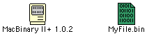

# Archive Formats

Files on old Macintosh systems often have metadata and extra data streams that they need in order to work correctly. If you copy a file from an old Macintosh computer to a Windows or Linux computer, and back, the extra data will be lost and the file may not work correctly.

The extra data that Macintosh archive formats must preserve are the file type code and creator code (see [Finder Info]()) and the resource fork (see [Resource Forks]()).

Files don’t always need special treatment. Plain text files and common image formats like PNG and JPEG are pure data. With software like PC Exchange or Software Exchange, the system can automatically set the file type code and creator code from the file’s extension. This is all you need for plain text, PNG, JPEG, and various other formtas.

However, applications and most types of files will not work correctly if the extra is lost. Archive formats provide ways to preserve this data.

## Which Format Should I Use?

This is a matter of opinion! However, some choices are better than others.

1. **Raw disk image** (extension `.img`, or sometimes `.dsk`) is the first choice you should consider. Raw disk images are easy to create, preserve all data, and can be used almost anywhere. Note that not all `.img` files are raw disk images.

1. **UDIF disk images** (extension `.dmg`) are preferred for archiving and distributing software for Mac OS X.

1. **NDIF disk images with MacBinary** (extension `.img.bin`) are useful for uploading and sharing software and files for Mac OS 9 and earlier.

## What Should I Avoid?

- Don’t transfer NDIF disk images without preserving the image’s resource fork.

- Don’t double-encode files. Stuffit archives do not need any further encoding. Rather than using `.sit.bin` or `.sit.hqx`, just use `.sit`.

## Disk Images

A disk image contains a complete copy of an HFS volume or other filesystem, stored as a file.

### Raw Disk Image

A raw disk image is a complete HFS (or other) filesystem, stored as a file. Raw disk are easy to create and can be used by emulators, vintage computers, and tools on modern computers. Raw disk images can be safely transferred to other systems without losing data. Note that files which have been deleted can sometimes be restored from raw disk images! DiskCopy lets you avoid this by choosing the “zero blocks” option, which is enabled by default.

Raw disk images often use the file extension `.img` or `.dsk`. You may find it useful to name your raw images with the `.dsk` extension to distinguish raw disk images from NDIF disk images.

You can create an empty raw disk image using DiskCopy, or create one from the contents of a folder. DiskCopy creates raw disk images when you choose a “read/write” image format.

The [HFS Utilities][hfsutils] package provides tools for moving data to and from raw disk images.

[hfsutils]: https://www.mars.org/home/rob/proj/hfs/

### DiskCopy 4.2 Disk Image

A DiskCopy 4.2 Disk image contains an image of a floppy disk, plus some metadata like data checksums. DiskCopy 4.2 images are supported by Mini vMac. They contain resource forks, but the image can be used even if the resource fork is deleted.

### NDIF Disk Image

An NDIF image contains a modified version of an HFS filesystem with additional metadata, such as checksums, stored in the file’s resource fork. This additional data appears to be stored in a 200-byte `'bcem'` resource with ID 128, but NDIF is not publicly documented and it is a matter of guesswork. If you delete the `'bcem'` resource, the disk image will not mount.

NDIF images can be compressed. If you want to transfer NDIF images to other systems, encode them with MacBinary (or another encoding that preserves the resource fork).

### UDIF Disk Image

A UDIF disk image is like an NDIF disk image, but contains all of its data in the data fork. UDIF appeared on Mac OS X, although it is reportedly possible to use them on Mac OS 9. You can also mount a UDIF image in Mac OS X and access the mounted image from the Classic environment.

UDIF disk images use the file extension `.dmg`. UDIF images are compressed by default.

### Self-Mounting Image

Self-mounting images typically use the extension `.smi`. Self-mounting images are applications. Running the application mounts the image.

### ISO, Toast

ISO and Toast images are disk images created for burning optical disks.

## Single-File Encodings

If you just need to preserve the Macintosh metadata for a single file, there are three common options.

### MacBinary

MacBinary combines a file’s data fork, resource fork, and metadata into a single file. It is the preferred encoding for transferring individual Macintosh files between systems or for working with Macintosh files on non-Macintosh systems.

MacBinary uses the `.bin` extension.

Note that if a file format has a well-known extension and does not need its resource fork, MacBinary is unnecessary. There is no point in creating a `.sit.bin` file, for example. This increases the file size but does not provide any benefits.

### BinHex

BinHex combines a file’s data fork, resource fork, and metadata into a single file. The result is encoded as pure ASCII text, which increases the file size, but allows BinHex files to be transferred over old email systems or newsgroups without being damaged. Old email systems are not _8-bit clean_ and would only transmit the low 7 bits of each byte. This worked for pure ASCII text files, but would mangle most other types of files. BinHex also uses a simple run-length encoding and stores CRC checksums of the data.

BinHex uses the `.hqx` extension.

It is common to see BinHex files on old websites, but the format has been superceded by MacBinary.

Note that it is not necessary or useful to encode Stuffit archives with BinHex, unless you are transferring data across a 7-bit connection (which is unlikely). If you see a `.sit.hqx` file, it can be safely decoded to a `.sit` file, even on non-Macintosh systems.

### AppleDouble, AppleSingle

AppleDouble is likely the most ubiquitous format for preserving Macintosh metadata, because it’s still used by modern versions of macOS to preserve medatada in zip files, on network shares, and on disk volumes formatted with non-Macintosh filesystems like FAT. AppleDouble is also used by A/UX.

AppleDouble is called “AppleDouble” because the data and metadata are stored in separate files. AppleSingle uses the same format, but stores the data and metadata in one file. AppleDouble is convenient because it lets you use the same files from both a Macintosh system and another system.

There is no standard file extension for AppleDouble files, but there is a standard prefix, which is `._`. If you save a file named `MyFile` on a FAT filesystem or Samba network share, Mac OS X will also create an AppleDouble file named `._MyFile`, if necessary. If you have used flash drives or network shares to share files between Mac OS X and other systems like Linux or Windows, you have problably seen these AppleDouble files (and the related `.DS_Store` files).

## Compression Formats

### Stuffit

Stuffit is the more popular compression program for the Macintosh during the 1990s and late 1980s. Stuffit archives use the `.sit` extension. Stuffit fell out of use after Apple released Mac OS X, and was replaced by `.zip` and `.dmg`.

Most Mac files shared on websites are compressed using Stuffit.

### Compact Pro

Compact Pro is a compression program which was somewhat less popular than Stuffit. Compact Pro archives use the `.cpt` extension.

### PackIt

PackIt is an early compression program for Macintosh. Files are compressed using simple Huffman coding. PackIt archives use the `.pit` extension. PackIt archives are rare.
