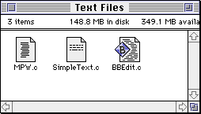
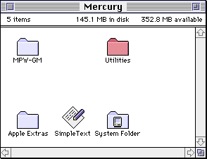
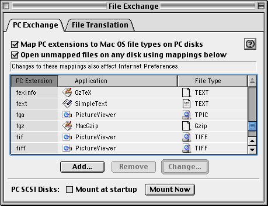

# Finder Info

Mac OS also stores a small piece of metadata for each file called _Finder Info_. As the name implies, this contains information which is primarily used by the Finder (Finder is the Mac OS shell, which shows the desktop and filesystem). For example, this includes the file’s type and its location on-screen.

There are different versions of the Finder info structure. This is what one of the older versions looks like, for a file:

```c
struct FileInfo {
  OSType  fileType;
  OSType  fileCreator;
  UInt16  finderFlags;
  Point   location;
  UInt16  reservedField;
};
```

## Preservation

When transferring files to old Macintosh systems, it’s usually necessary to assign a correct type code for every file. It can be frustrating to work with files that do not have the correct type code, and you may not be able to open these files at all.


There are various tools which can fix this problem. ResEdit can fix this problem, and there are some more specialized tools designed specifically to deal with this problem.

## Type and Creator Codes

Older versions of Mac OS do not use filename suffixes to associate files with applications. You can use any name you like for a file, and the file type is given by the file’s type code. The application to open it is given by the file’s creator code.

The type code is a four-character code used to describe the type of the file. For example, `TEXT` is used for text files, `JPEG` is used for JPEG images, and `APPL` is for application programs. File types are used to figure out which applications can open a specific file. For example, SimpleText can open text files, but it refuses to open application programs.

The creator code is second four-character code used to associate the file with a specific application. For example, SimpleText has the creator code `ttxt`, and PictureViewer uses creator code `ogle`. When you double-click on a file in the Finder, the Finder launches the application with the corresponding creator code, if it exists. The creator code for a file also determines what icon it uses in the Finder.

For example, this screenshot shows three text files in a folder. Each file has the same filename suffix, `.c`, but that suffix is irrelevant here. Since the files were created with three different programs, they have three different icons—the text file icon for SimpleText files, MPW files, and BBEdit files.



## Location and Color

You can see that the Finder lets you freely place your files in different locations within a window. You can also assign one of eight different labels to a file or folder—each label corresponds to a specific name and color. The location and color are stored in the Finder info.

Here is what this looks like System 7. The “Utilities” folder below is given a label which makes the icon red.



## Rebuilding the Desktop

Volumes on an old Macintosh system contain an invisible file named “Desktop DB”. This file contains a record of all the applications on the system and the file types that they can open.

Unfortunately, this database can easily become outdated. When it’s outdated, some applications and files on your computer will use the generic application and file icons, rather than the correct icons. You can rebuild the database by holding down the command and option keys while the computer starts—hold these keys down until you can see the files and folders on your desktop.

## File Extensions

Some systems have a control panel called _PC Exchange_ or _File Exchange_, which lets you assign a default type code and creator code to files based on their extension. This was primarily used so that you could read disks formatted for DOS or Windows on a Macintosh, and more easily exchange files with people using DOS or Windows.



Starting with Mac OS X, file extensions became the primary way to identify file types, and type codes became unnecessary.
