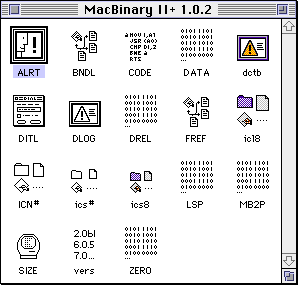
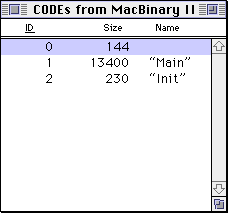
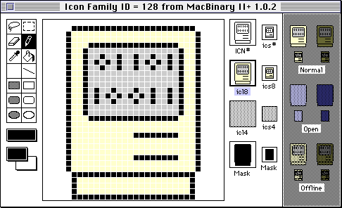
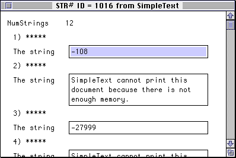

# Resource Forks

Mac OS traditionally provided two _forks_ for a file: the data fork and the resource fork. A fork is a data stream within a file which can be independently manipulated. You can open one fork and write data to it, change the length of data, or delete the fork entirely without affecting the file’s other fork. Think of the forks as two separate files, bundled up as one file.

When you copy a file from a non-Mac OS system to a Mac, what you get is a file that only contains a data fork. The resource fork is used to store Mac-specific data. It’s almost always organized into chunks called _resources_, which are discrete pieces of data surch as icons, images, sounds, strings, or 68K code segments. Each resource is identified by a four-character type code and 16-bit ID number.

The resource fork format has a maximum size of about 16 MiB because it encodes file offsets using 24 bits.

## Historical Use

Prior to Mac OS X, programs on the Mac make heavy use of the resource fork. For example, an application’s resource fork contains 68K code, icons, dialog box layouts, version information, text data, and sometimes various custom data types. PowerPC code is stored in the data fork, although various resources are still necessary for PowerPC applications to run correctly.

Applications also use resource forks in other files to store data. Some text editors use the resource fork of a text file to remember the state of the text editor when editing that file. Games often use files with resource forks to store images, sound effects, or level data.

Starting with Mac OS X, data that was previously stored as resources in the resource fork are stored as a separate file instead. For example, application and file icons prior to Mac OS X are stored in the resource fork, but in Mac OS X, each icon is stored as a separate file. It is unusual to find a Mac OS X program that uses the resource fork at all.

## Are Resource Forks Really Structured?

Note the key words above: a resource fork is **almost always** organized into chunks called resources.

A file’s resource fork is really just an alternate stream of data, like the data fork. You can put whatever data you like in the resource fork. In practice, the resource fork almost always uses a specific format.

Note that this goes both ways. Just like you can store arbitrary data in the resource fork, you can also use the data fork to store resources. Using the data fork to store resources has disadvantages, because you can’t edit those resources with ResEdit or use the Macintosh resource manager API to read those resources, so it is rarely done.

Some applications store application preferences or other data in the resource fork of a file, and because resource forks can get corrupted, you occasionally see a backup copy of the resource fork stored in the data fork of the same file. This is not common, however.

## Preserving Resource Forks

Resource forks do not always need to be preserved when synchronizing files between systems. It depends on the file and what is being stored in the resource fork. For example, when you save a text file in BBEdit or MPW, the editor state is recorded as a resource in the text file. Deleting this resource fork doesn’t affect your ability to use the file. On the other hand, if you delete the resource fork of an application, it won’t work at all.

## Examining the Resource Fork

You can use _ResEdit_ or _Resorcerer_ to view and edit the resources in a resource fork, or the MPW tools _Rez_ and _DeRez_.

ResEdit is the most common tool to use, because it’s free (unlike Resorcerer, which costs $256) and has a nice user interface (unlike Rez and DeRez, which convert resource files to and from text files). ResEdit is available from Apple and the latest version is 2.1.3. Here’s what the resource fork of the MacBinary application looks like in ResEdit:

When you open a file in ResEdit, ResEdit shows you an overview of the different types of resources in the file. MacBinary contains 18 different types of resources. When you open one of the types, ResEdit shows you a list of resources for that type. For example, we can look at the `CODE` resources in MacBinary, which contain segments of executable 68K code which can be independently loaded. Each individual resource has an ID, which is a signed 16-bit number, and optionally has a name.

ResEdit provides simple editors for certain types of resources, like icons. This makes it easy to create your own custom icons for Macintosh applications. You didn’t have to be a programmer to take advantage of this—if you wanted to create your own custom folder icons for certain folders, you could do that too. You could find custom icon collections online or on CDs bundled with magazines.

Application and folder icons are made from several types of icons with the same ID number, creating an icon family. An icon family allows you to create custom icons for different sizes and color depths.

Another common type of resource is string resources. Applications sometimes store strings used by the application in these resources. This might be done to reduce the memory footprint of the application, or it might be done to make it easier to translate an application into another language.

It’s not necessary to use string resources at all, and MacBinary doesn’t contain any string resources. There are string resources in _SimpleText_, however, containing help messages, error messages, and various other strings.

